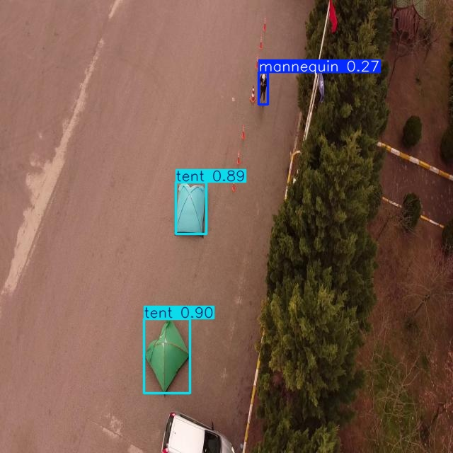
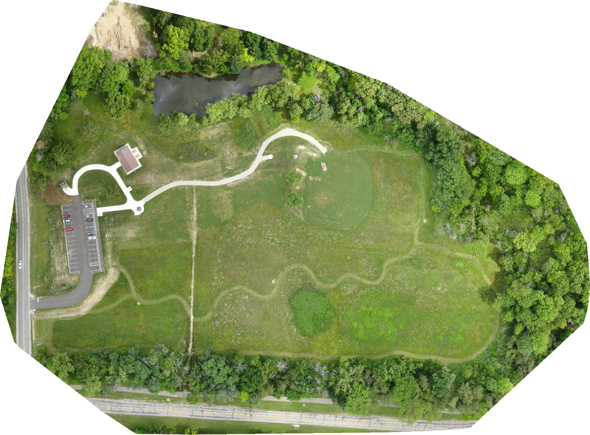
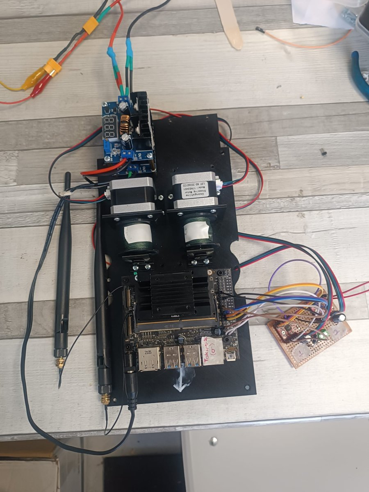

# SUAS 2026 — Autonomous UAV System | Girift UAV Team

**🇬🇧 English** · [🇹🇷 Türkçe](#türkçe)

Software and hardware modules I developed for the **Girift UAV team**'s fully autonomous drone in the international **SUAS 2026** (Student Unmanned Aerial Systems) competition. Girift UAV is the drone team of Adana Alparslan Türkeş Science and Technology University.

<p align="center">
  
  
  
</p>

## The mission

The drone takes off on its own and scans a defined search area. While it flies, it **maps the area** and **detects people and tents** on the ground, then calculates the GPS position of each target. Once the search is done, it returns to those targets and **delivers supplies** (a water bottle and a flashlight) by lowering them on a line, without ever descending below 45 m (150 ft).

```
 Takeoff → Search the area ──┬──► Object detection ──► GPS target positions ──┐
                             │                                              │
                             └──► Real-time mapping ──► Orthophoto map        │
                                                                            ▼
                                                   Fly to each target → Payload delivery
```

## Modules

| Module | What it does | Highlights |
|---|---|---|
| 🎯 [**Object detection**](object-detection/README.md) | Detects people (mannequins) and tents in aerial images | YOLOv8n trained on ~8,200 hand-labeled images · 0.932 mAP50 · TensorRT on Jetson Nano at ~12 FPS |
| 🗺️ [**Aerial mapping**](aerial-mapping/README.md) | Builds a georeferenced map while the drone is still flying | Spatial clustering of photos into batches · NodeODM in Docker · incremental + final GeoTIFF orthophoto |
| 📦 [**Payload delivery**](payload-delivery/README.md) | Lowers two payloads to their targets from 45 m | Dual-winch NEMA17 stepper system · hand-soldered driver board · controlled directly by Jetson GPIO |

Each module has its own page with the design, the decisions behind it, results and lessons learned.

## Tech stack

**Software:** Python · Ultralytics YOLOv8 · PyTorch · TensorRT · ONNX · OpenCV · NodeODM / OpenDroneMap · Docker · rasterio (GDAL) · MAVLink · GStreamer

**Hardware:** NVIDIA Jetson Nano · NEMA17 stepper motors · A4988 drivers · SIYI A8 mini gimbal camera · Pixhawk flight controller · 3D printing

## Repository access

This repository is a showcase. The source code, model weights and dataset are kept in private repositories. Access is available on request.

---

## Türkçe

**Girift İHA Takımı**'nın uluslararası **SUAS 2026** (Student Unmanned Aerial Systems) yarışması için geliştirdiği tam otonom drone'da benim geliştirdiğim yazılım ve donanım modülleri. Girift İHA, Adana Alparslan Türkeş Bilim ve Teknoloji Üniversitesi'nin İHA takımıdır.

## Görev

Drone kendi kendine kalkıyor ve belirlenen bir arama alanını tarıyor. Uçarken **alanın haritasını çıkarıyor** ve yerdeki **insanları ve çadırları tespit ediyor**, ardından her hedefin GPS konumunu hesaplıyor. Tarama bitince bu hedeflere geri dönüyor ve 45 m'nin (150 ft) altına hiç inmeden, malzemeleri (su şişesi ve fener) iple aşağı indirerek **teslim ediyor**.

## Modüller

| Modül | Ne yapıyor | Öne çıkanlar |
|---|---|---|
| 🎯 [**Nesne tespiti**](object-detection/README.md) | Hava görüntülerinde insanları (mankenleri) ve çadırları tespit ediyor | ~8.200 elle etiketlenmiş görselle eğitilen YOLOv8n · 0,932 mAP50 · Jetson Nano'da TensorRT ile ~12 FPS |
| 🗺️ [**Hava haritalama**](aerial-mapping/README.md) | Drone henüz uçarken coğrafi konumlu bir harita oluşturuyor | Fotoğrafların mekânsal kümelemeyle paketlenmesi · Docker'da NodeODM · birleşik + kesin GeoTIFF ortofoto |
| 📦 [**Yük bırakma**](payload-delivery/README.md) | İki yükü 45 m yükseklikten hedeflerine indiriyor | Çift vinçli NEMA17 step motor sistemi · elle lehimlenmiş sürücü kartı · doğrudan Jetson GPIO ile kontrol |

Her modülün kendi sayfasında tasarımı, arkasındaki kararlar, sonuçlar ve öğrenilenler anlatılıyor.

## Repo erişimi

Bu repo bir vitrin. Kaynak kodlar, model ağırlıkları ve veri seti private repolarda tutuluyor. Talep üzerine erişim verilebilir.
