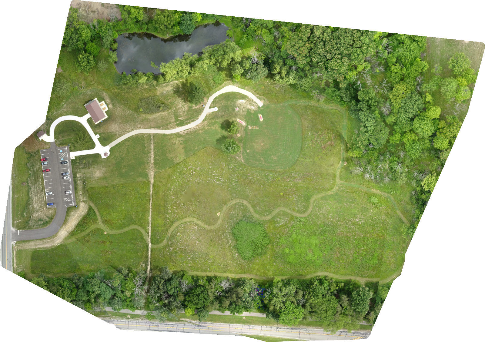

[← SUAS 2026 overview](../README.md)

# Autonomous Aerial Mapping System — SUAS 2026

**🇬🇧 English** · [🇹🇷 Türkçe](#türkçe)

A real-time mapping pipeline that turns GPS-tagged aerial photos into a georeferenced map (orthophoto, GeoTIFF) **while the drone is still flying**, then produces a seamless high-quality final map as soon as the flight ends.

Developed as the mapping module of the **Girift UAV team**'s autonomous drone for the **SUAS 2026** (Student Unmanned Aerial Systems) competition.

## Output maps

<p align="center">
  
  
</p>
<p align="center">
  <em>Left: incremental map, built piece by piece during the flight. Right: final map, generated from all photos after the flight.</em>
</p>

Full-resolution GeoTIFF files (can be opened in QGIS) are available on the [Releases](https://github.com/sedanuroz/SUAS2026-Showcase/releases) page.

## My role

I designed and built the entire mapping system end to end:

- **Drone side (Jetson):** distance-based photo triggering, reading GPS and gimbal angle, writing them into EXIF, camera integration and TCP transfer to the ground station
- **Ground station:** folder watching, the chain-growth spatial clustering algorithm, NodeODM integration, merging batch maps and generating the final map
- **Infrastructure:** NodeODM setup in Docker, the one-command launcher, cross-platform (Windows/Linux) support and testing

## The problem

Photogrammetry tools normally wait until every photo has been collected and then process them all at once. In a competition mission that costs valuable time, because the ground station can't see the mapped area until the drone has landed.

This system solves that with **two maps**:

| Map | When | How | Goal |
|---|---|---|---|
| **Incremental map** | During flight, updated continuously | Photos are grouped into spatially coherent batches of 30, each batch is processed separately, and the pieces are merged | **Speed:** the ground station sees the area before the flight ends |
| **Final map** | Right after the flight | All photos are processed together in a single job | **Quality:** a seamless, consistent final orthophoto |

## How it works

```
 ┌──────────── DRONE (NVIDIA Jetson) ────────────┐
 │  Gimbal camera ─► frame                        │
 │  Flight controller (MAVLink) ─► GPS            │
 │  Gimbal ─► camera angle                        │
 │                                                │
 │  Distance since last photo > threshold?        │
 │    └─► capture → write GPS + angle into EXIF   │
 │        → send to ground station over TCP       │
 └───────────────────────┬────────────────────────┘
                         │ radio link
                         ▼
 ┌──────────────── GROUND STATION ────────────────┐
 │  Watched folder ─► photo pool                  │
 │    ├─ chain-growth spatial clustering → batch  │
 │    ├─ batch → NodeODM (background thread)      │
 │    ├─ download batch orthophoto                │
 │    └─ merge all pieces → INCREMENTAL MAP       │
 │                                                │
 │  Flight ends ─► all photos in one job          │
 │               → FINAL MAP                      │
 └────────────────────────────────────────────────┘
```

**1. On the drone: smart photo triggering.** Instead of taking photos on a timer, the Jetson triggers a photo whenever the drone has travelled far enough to keep the target overlap between images. The distance threshold is calculated from the camera calibration, flight altitude and desired overlap:

```
HFOV            = 2 · atan(image_width / (2 · fx))
ground_width    = 2 · altitude · tan(HFOV / 2)
trigger_spacing = ground_width · (1 − overlap)
```

Each photo's GPS position and gimbal angle are written into its EXIF data, and the photo is sent to the ground station over TCP.

**2. On the ground: spatial batching.** Photogrammetry only works on overlapping images, so sending 30 random photos would produce a broken map. A **chain-growth clustering** algorithm builds each batch by repeatedly adding the nearest neighbouring photo. This way, every batch can be turned into a valid mini-map on its own.

**3. Parallel processing.** Each batch is sent to NodeODM (OpenDroneMap's processing engine, running in Docker) on a background thread, so new photos keep flowing in without blocking. Finished batch maps are downloaded and merged into one GeoTIFF with `rasterio`. Completed jobs are deleted from NodeODM so the disk doesn't fill up during long flights.

**4. Final map.** When the flight ends, a separate process sends all photos to NodeODM as a single job and produces the final orthophoto. It runs independently of the main program, so it keeps working even if the terminal is closed.

## Results

- Validated end-to-end on the OpenDroneMap **Aukerman** sample dataset (77 GPS-tagged nadir photos): both the incremental and the final map were generated successfully. The final map took about **11 minutes** in a single job.
- Field configuration: 50 m altitude, 12 m trigger spacing, about one photo every 1.5 s at 8 m/s.

## Engineering challenges solved

- **Cross-platform ground station:** The system runs on both Windows and Linux. This required replacing Unix-only calls (`os.setpgrp`, `cp`), switching from the `gdalwarp` command-line tool to `rasterio.merge`, and fixing Windows log encoding issues.
- **Stale data contaminating maps:** Batches left over from earlier runs were mixing into new maps. A one-command launcher now cleans old outputs, checks that NodeODM is running, and starts the system.
- **Unbuffered logging:** The final-map process runs with unbuffered output, so its progress can be followed live.
- **Camera integration on Jetson:** The camera stream was labelled H.264 but was actually H.265, so it was decoded with a hardware-accelerated GStreamer pipeline instead of OpenCV. Network issues between the camera and the radio link were also resolved.
- **Georeferencing accuracy:** The gimbal is pointed straight down (nadir) before any capture starts, so that photo positions line up correctly on the map.

## Next steps

- Full end-to-end validation of the capture → EXIF → TCP → map chain in a real flight
- Confirming the gimbal's nadir position by reading back its angle, instead of waiting a fixed time
- Adjusting the trigger spacing dynamically when altitude changes

## Tech stack

Python · NodeODM / OpenDroneMap · Docker · pyodm · rasterio (GDAL) · watchdog · piexif · MAVLink · GStreamer · NVIDIA Jetson

## Repository access

The source code is kept in a private repository. Access is available on request.

---

## Türkçe

GPS etiketli hava fotoğraflarından, **drone henüz uçarken** coğrafi konumlu bir harita (ortofoto, GeoTIFF) üreten ve uçuş biter bitmez dikişsiz, yüksek kaliteli bir nihai harita oluşturan gerçek zamanlı bir haritalama sistemi.

**Girift İHA Takımı**'nın **SUAS 2026** (Student Unmanned Aerial Systems) yarışması için geliştirdiği otonom drone'un haritalama modülüdür.

## Çıktı haritalar

Haritaların önizlemeleri yukarıdaki İngilizce bölümde yer alıyor. Solda uçuş sırasında parça parça oluşan **birleşik harita**, sağda uçuştan sonra tüm fotoğraflardan üretilen **kesin harita** var. Tam çözünürlüklü GeoTIFF dosyaları (QGIS ile açılabilir) [Releases](https://github.com/sedanuroz/SUAS2026-Showcase/releases) sayfasında.

## Rolüm

Haritalama sisteminin tamamını baştan sona ben tasarlayıp geliştirdim:

- **Drone tarafı (Jetson):** mesafeye göre fotoğraf tetikleme, GPS ve gimbal açısını okuma, bunları EXIF'e yazma, kamera entegrasyonu ve fotoğrafları TCP ile yer istasyonuna gönderme
- **Yer istasyonu:** klasör izleme, zincir büyütme kümeleme algoritması, NodeODM entegrasyonu, paket haritalarının birleştirilmesi ve kesin haritanın üretilmesi
- **Altyapı:** Docker'da NodeODM kurulumu, tek komutluk başlatıcı, Windows/Linux uyumluluğu ve testler

## Problem

Fotogrametri araçları normalde tüm fotoğrafların toplanmasını bekler ve hepsini tek seferde işler. Yarışma görevinde bu değerli zaman kaybı demektir, çünkü yer istasyonu drone inene kadar haritalanan alanı göremez.

Bu sistem sorunu **iki harita** ile çözüyor:

| Harita | Ne zaman | Nasıl | Amaç |
|---|---|---|---|
| **Birleşik harita** | Uçuş sırasında, sürekli güncellenir | Fotoğraflar mekânsal olarak tutarlı 30'luk paketlere ayrılır, her paket ayrı işlenir ve parçalar birleştirilir | **Hız:** yer istasyonu alanı uçuş bitmeden görür |
| **Kesin harita** | Uçuş bittikten hemen sonra | Tüm fotoğraflar tek bir görevde birlikte işlenir | **Kalite:** dikişsiz, tutarlı nihai ortofoto |

## Nasıl çalışıyor

Sistem mimarisi için yukarıdaki İngilizce bölümdeki şemaya bakabilirsiniz.

**1. Drone'da: akıllı fotoğraf tetikleme.** Jetson, belirli aralıklarla fotoğraf çekmek yerine, drone fotoğraflar arasındaki hedef bindirmeyi (overlap) koruyacak kadar yol aldığında fotoğraf çeker. Bu mesafe eşiği kamera kalibrasyonu, uçuş irtifası ve istenen bindirme oranından hesaplanır:

```
HFOV          = 2 · atan(görüntü_genişliği / (2 · fx))
iz_genişliği  = 2 · irtifa · tan(HFOV / 2)
mesafe_eşiği  = iz_genişliği · (1 − overlap)
```

Her fotoğrafın GPS konumu ve gimbal açısı EXIF verisine yazılır ve fotoğraf TCP ile yer istasyonuna gönderilir.

**2. Yerde: mekânsal paketleme.** Fotogrametri sadece örtüşen fotoğraflarla çalışır, rastgele 30 fotoğraf göndermek bozuk bir harita üretir. **Zincir büyütme kümeleme** algoritması her paketi en yakın komşu fotoğrafı ekleyerek oluşturur. Böylece her paket tek başına geçerli bir mini harita üretebilir.

**3. Paralel işleme.** Her paket, yeni fotoğrafların akışını engellememek için arka planda bir thread üzerinden NodeODM'e (OpenDroneMap'in Docker'da çalışan işleme motoru) gönderilir. Biten paket haritaları indirilir ve `rasterio` ile tek bir GeoTIFF'te birleştirilir. Tamamlanan görevler NodeODM'den silinir, böylece uzun uçuşlarda disk dolmaz.

**4. Kesin harita.** Uçuş bitince ayrı bir süreç tüm fotoğrafları tek bir görev olarak NodeODM'e gönderir ve nihai ortofotoyu üretir. Bu süreç ana programdan bağımsız çalışır, terminal kapansa bile işini sürdürür.

## Sonuçlar

- OpenDroneMap'in **Aukerman** örnek veri setiyle (77 GPS etiketli, tam aşağı bakan fotoğraf) uçtan uca doğrulandı: hem birleşik hem kesin harita başarıyla üretildi. Kesin harita tek görevde yaklaşık **11 dakika** sürdü.
- Saha ayarları: 50 m irtifa, 12 m fotoğraf aralığı, 8 m/s hızda yaklaşık 1,5 saniyede bir fotoğraf.

## Çözülen mühendislik problemleri

- **Platformlar arası yer istasyonu:** Sistem hem Windows'ta hem Linux'ta çalışıyor. Bunun için sadece Unix'te olan çağrılar (`os.setpgrp`, `cp`) değiştirildi, `gdalwarp` komut satırı aracı yerine `rasterio.merge` kullanıldı ve Windows'taki log kodlama sorunları giderildi.
- **Eski verilerin haritaya karışması:** Önceki çalıştırmalardan kalan paketler yeni haritalara karışıyordu. Artık tek komutluk bir başlatıcı eski çıktıları temizliyor, NodeODM'in çalıştığını kontrol ediyor ve sistemi başlatıyor.
- **Tamponsuz loglama:** Kesin harita süreci tamponsuz çıktı ile çalışıyor, böylece ilerlemesi canlı olarak izlenebiliyor.
- **Jetson'da kamera entegrasyonu:** Kamera akışı H.264 olarak etiketlenmişti ama aslında H.265'ti. Bu yüzden OpenCV yerine donanım hızlandırmalı bir GStreamer hattı ile çözüldü. Kamera ile telsiz bağlantısı arasındaki ağ sorunları da giderildi.
- **Konumlandırma doğruluğu:** Gimbal, fotoğraf çekimi başlamadan önce tam aşağıya (nadir) çevriliyor. Böylece fotoğrafların harita üzerindeki konumları doğru çıkıyor.

## Sonraki adımlar

- Fotoğraf çekme → EXIF → TCP → harita zincirinin gerçek uçuşta uçtan uca doğrulanması
- Gimbal'in nadir konumunu sabit süre beklemek yerine açısını okuyarak doğrulamak
- İrtifa değiştiğinde fotoğraf aralığını dinamik olarak ayarlamak

## Teknolojiler

Python · NodeODM / OpenDroneMap · Docker · pyodm · rasterio (GDAL) · watchdog · piexif · MAVLink · GStreamer · NVIDIA Jetson

## Repo erişimi

Kaynak kod private bir repoda tutuluyor. Talep üzerine erişim verilebilir.
