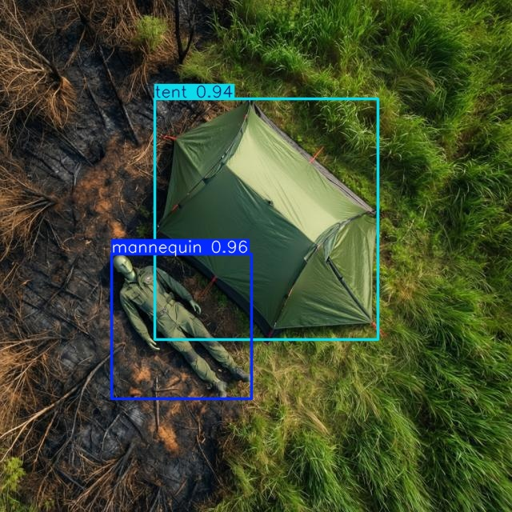
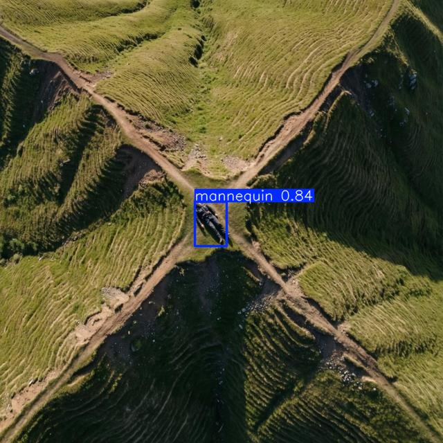

[← SUAS 2026 overview](../README.md)

# Aerial Mannequin & Tent Detection — YOLOv8n

**🇬🇧 English** · [🇹🇷 Türkçe](#türkçe)

A custom object detection model that finds **people (mannequins)** and **tents** in aerial drone imagery, built for the **SUAS 2026** (Student Unmanned Aerial Systems) competition.

## Mission context

In the SUAS 2026 mission, the drone takes off autonomously, scans a defined search area and detects people and tents on the ground. It then calculates the GPS position of each detection. Once the search is complete, it returns to those locations to drop supplies such as water and a flashlight.

Reliable onboard object detection is the first link in this chain: if a target isn't detected, it can't be located or served. This model provides that detection step.

## Detection examples

<p align="center">
  
  
  
</p>
<p align="center">
  <em>Left: real footage from a test flight. Middle: synthetic aerial image from the dataset. Right: mannequin detection.</em>
</p>

## My role

This was developed as part of the **Girift UAV team**. I was responsible for the object detection model:

- Collecting and curating the dataset, with a focus on aerial top-down images
- Labeling and preparing the data in Roboflow
- Training the model and iterating on it
- Evaluating its performance and testing whether it worked well enough for the mission
- Deploying it on the onboard NVIDIA Jetson Nano and optimizing it with TensorRT for real-time inference

## Highlights

| | |
|---|---|
| **Model** | YOLOv8n (3.0M parameters, 8.1 GFLOPs) |
| **Classes** | `mannequin`, `tent` |
| **mAP50** | **0.932** |
| **mAP50-95** | **0.708** |
| **Inference** | 2.2 ms / image (Tesla T4, 640×640) |
| **Deployment** | ONNX → TensorRT engine on NVIDIA Jetson Nano, **~12 FPS** real-time |

## Dataset

I built and labeled the dataset in Roboflow, focusing on **top-down images taken from a drone** to match the real mission view. I deliberately balanced the scene composition, with images containing only tents, only people, and both together, so the model learns to detect each class on its own and when they appear side by side.

| Split | Images | Labeled objects |
|---|---|---|
| Train | 7,488 | 25,869 |
| Validation | 445 | 1,729 (1,470 mannequin, 259 tent) |
| Test | ~245 | — |

In total, the dataset contains **~8,200 labeled images**. None of them are augmented copies.

**Real + synthetic data:** The dataset combines real drone footage from our own test flights with AI-generated (synthetic) aerial images. The synthetic images add scene variety that is hard to capture in real flights, such as different terrain, lighting conditions and tent types.

**Augmentation during training:** Instead of creating augmented copies in advance, augmentation was applied on the fly during training (mosaic, horizontal flips, color/brightness shifts, scaling, translation, random erasing and light blur). Because of this, the model sees a slightly different version of each image in every epoch.

## Training

| Setting | Value |
|---|---|
| Framework | Ultralytics 8.4 |
| Base weights | `yolov8n.pt` (COCO pretrained) |
| Epochs | 100 |
| Image size | 640 |
| Batch size | 16 |
| Hardware | Google Colab, Tesla T4 |
| Training time | ~3.6 hours |

## Results (validation set)

| Class | Precision | Recall | mAP50 | mAP50-95 |
|---|---|---|---|---|
| **All** | 0.928 | 0.875 | 0.932 | 0.708 |
| Mannequin | 0.924 | 0.884 | 0.938 | 0.652 |
| Tent | 0.931 | 0.865 | 0.925 | 0.763 |

## Deployment

```
best.pt  →  best.onnx  →  best.engine
(PyTorch)   (portable)     (TensorRT, optimized for Jetson)
```

I set up the model on the drone's onboard NVIDIA Jetson Nano. In the first tests, running the standard PyTorch model was too slow for the mission: the live video stuttered and froze. To fix this, I exported the model to ONNX and compiled it into a TensorRT engine. After that, it ran much faster and detection on the live camera feed became smooth, at **~12 FPS** on the Jetson Nano.

## Part of a larger system

The detector is one component of the team's fully autonomous SUAS 2026 UAV system, which also includes:

- GPS localization of detected targets
- [Real-time aerial mapping](../aerial-mapping/README.md) that builds orthophotos from flight data (NodeODM)
- [Winch-based payload delivery](../payload-delivery/README.md) controlled through Jetson GPIO
- Autonomous mission execution over MAVLink, with a web-based ground control panel

## Limitations & next steps

- **Class imbalance:** tents make up about 15% of labeled objects.
- **Possible frame overlap:** some images are consecutive video frames, so validation scores may be slightly optimistic. The next step is to test on unseen flight footage.
- **Domain gap:** part of the dataset is ground-level photography of people and tents, while deployment is aerial. Adding more top-down images would make the model more robust.

## Repository access

The model weights, the full dataset and the inference code are kept in a private repository. Access is available on request.

## Tech stack

Python · Ultralytics YOLOv8 · PyTorch · Roboflow · Google Colab · ONNX · TensorRT · NVIDIA Jetson Nano · OpenCV · MAVLink

---

## Türkçe

Hava görüntülerinde **insanları (mankenleri)** ve **çadırları** bulan, **SUAS 2026** (Student Unmanned Aerial Systems) yarışması için geliştirilmiş özel bir nesne tespit modeli.

Örnek tespit görselleri için yukarıdaki İngilizce bölüme bakabilirsiniz.

## Görev bağlamı

SUAS 2026 görevinde drone otonom olarak kalkıyor, belirlenen bir arama alanını tarıyor ve yerdeki insanları ve çadırları tespit ediyor. Ardından her tespitin GPS konumunu hesaplıyor. Tarama bitince bu konumlara geri dönüp su ve fener gibi malzemeler bırakıyor.

Güvenilir nesne tespiti bu zincirin ilk halkası: tespit edilemeyen bir hedefin konumu bulunamaz ve ona malzeme ulaştırılamaz. Bu model o tespit adımını sağlıyor.

## Rolüm

Bu proje **Girift İHA Takımı** kapsamında geliştirildi. Nesne tespit modelinden ben sorumluydum:

- Yukarıdan çekilmiş hava görüntülerine odaklanarak veri setini toplamak ve düzenlemek
- Verileri Roboflow'da etiketlemek ve hazırlamak
- Modeli eğitmek ve geliştirmek
- Performansını değerlendirmek ve görev için yeterli olup olmadığını test etmek
- Modeli drone üzerindeki NVIDIA Jetson Nano'ya kurmak ve gerçek zamanlı çalışması için TensorRT ile optimize etmek

## Öne çıkanlar

| | |
|---|---|
| **Model** | YOLOv8n (3,0M parametre, 8,1 GFLOPs) |
| **Sınıflar** | `mannequin`, `tent` |
| **mAP50** | **0,932** |
| **mAP50-95** | **0,708** |
| **Çıkarım süresi** | Görsel başına 2,2 ms (Tesla T4, 640×640) |
| **Deployment** | ONNX → TensorRT engine, NVIDIA Jetson Nano üzerinde **~12 FPS** gerçek zamanlı |

## Veri seti

Veri setini, gerçek görev görüntüsüne uyması için **drone'dan yukarıdan çekilmiş görsellere** odaklanarak Roboflow'da oluşturup etiketledim. Sahne dağılımını bilinçli olarak dengeledim: sadece çadır, sadece insan ve ikisini birlikte içeren görseller. Böylece model her sınıfı hem tek başına hem de yan yana olduklarında tespit etmeyi öğreniyor.

| Bölüm | Görsel | Etiketli nesne |
|---|---|---|
| Train | 7.488 | 25.869 |
| Validation | 445 | 1.729 (1.470 manken, 259 çadır) |
| Test | ~245 | — |

Veri seti toplamda **~8.200 etiketli görsel** içeriyor. Hiçbiri augmentation ile üretilmiş kopya değil.

**Gerçek + sentetik veri:** Veri seti, kendi test uçuşlarımızdan alınan gerçek drone görüntülerini yapay zekâyla üretilmiş (sentetik) hava görselleriyle birleştiriyor. Sentetik görseller, gerçek uçuşlarda yakalanması zor olan çeşitliliği ekliyor: farklı araziler, ışık koşulları ve çadır tipleri.

**Eğitim sırasında augmentation:** Önceden augmentation'lı kopyalar üretmek yerine, augmentation eğitim sırasında anlık olarak uygulandı (mosaic, yatay çevirme, renk/parlaklık değişimi, ölçekleme, kaydırma, rastgele silme ve hafif bulanıklaştırma). Bu sayede model her epoch'ta her görselin biraz farklı bir versiyonunu görüyor.

## Eğitim

| Ayar | Değer |
|---|---|
| Framework | Ultralytics 8.4 |
| Başlangıç ağırlıkları | `yolov8n.pt` (COCO ile önceden eğitilmiş) |
| Epoch | 100 |
| Görsel boyutu | 640 |
| Batch size | 16 |
| Donanım | Google Colab, Tesla T4 |
| Eğitim süresi | ~3,6 saat |

## Sonuçlar (validation seti)

| Sınıf | Precision | Recall | mAP50 | mAP50-95 |
|---|---|---|---|---|
| **Tümü** | 0,928 | 0,875 | 0,932 | 0,708 |
| Manken | 0,924 | 0,884 | 0,938 | 0,652 |
| Çadır | 0,931 | 0,865 | 0,925 | 0,763 |

## Deployment

Modeli drone üzerindeki NVIDIA Jetson Nano'ya kurdum. İlk testlerde standart PyTorch modeli görev için çok yavaştı: canlı görüntü takılıyor ve donuyordu. Bunu çözmek için modeli ONNX formatına çevirip bir TensorRT engine'e derledim. Bundan sonra çok daha hızlı çalıştı ve canlı kamera görüntüsünde tespit, Jetson Nano'da **~12 FPS** ile akıcı hale geldi.

## Kısıtlar ve sonraki adımlar

- **Sınıf dengesizliği:** Etiketli nesnelerin yaklaşık %15'i çadır.
- **Olası kare benzerliği:** Bazı görseller aynı videodan art arda alınmış kareler, bu yüzden validation skorları biraz iyimser olabilir. Sonraki adım, modeli daha önce görmediği uçuş görüntülerinde test etmek.
- **Görüntü türü farkı:** Veri setinin bir kısmı yerden çekilmiş insan ve çadır fotoğraflarından oluşuyor, ama model havadan kullanılıyor. Daha fazla yukarıdan çekilmiş görsel eklemek modeli daha dayanıklı yapar.

## Repo erişimi

Model ağırlıkları, veri setinin tamamı ve çıkarım kodu private bir repoda tutuluyor. Talep üzerine erişim verilebilir.

## Teknolojiler

Python · Ultralytics YOLOv8 · PyTorch · Roboflow · Google Colab · ONNX · TensorRT · NVIDIA Jetson Nano · OpenCV · MAVLink
