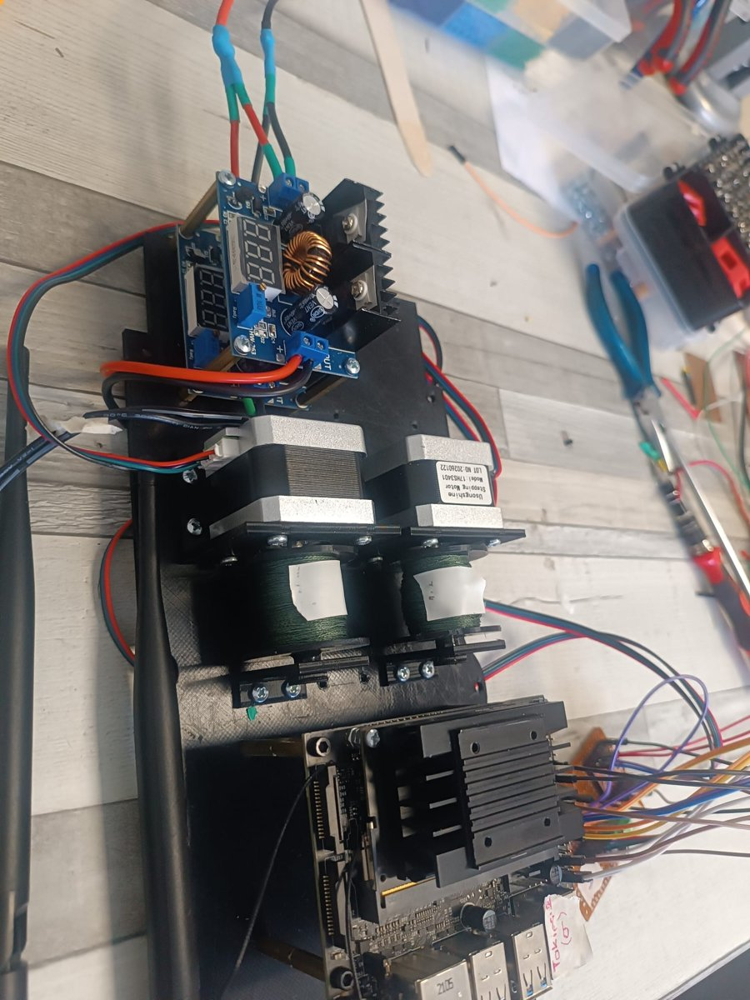
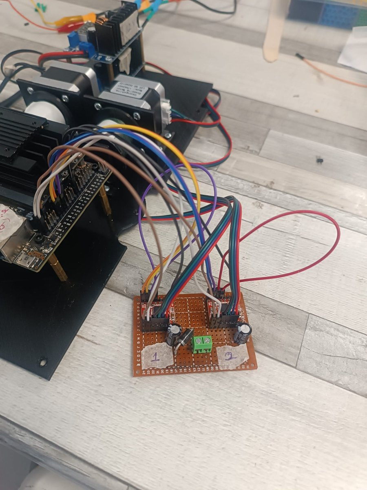

[← SUAS 2026 overview](../README.md)

# Winch-Based Payload Delivery System — SUAS 2026

**🇬🇧 English** · [🇹🇷 Türkçe](#türkçe)

A dual-winch payload delivery system that lowers two payloads to ground targets **without landing**, while the drone hovers at least 45 m (150 ft) above ground. It was developed for the **Girift UAV team**'s autonomous drone in the **SUAS 2026** (Student Unmanned Aerial Systems) competition.

## Hardware

<p align="center">
  
  
  
</p>
<p align="center">
  <em>Left: the complete module on its mounting plate. Middle: the two NEMA17 motors with winch drums and the XL4016 power supply. Right: the custom driver board wired to the Jetson Nano GPIO.</em>
</p>

The whole system is built as a single module on one mounting plate: two stepper motors with their winch drums, the XL4016 buck converter (with a voltage display) that powers the motors, and the Jetson Nano that controls them. The two A4988 drivers sit on a **hand-soldered perfboard driver board** with their decoupling capacitors and a screw terminal for motor power. The two channels are labelled 1 and 2 to match the two payloads.

## The challenge

Competition rules don't allow the drone to descend below 150 ft (≈45 m) AGL during delivery. Dropping the payloads freely from that height would damage them and land them off target. The solution is to lower each payload on a line until it reaches the ground.

The drone carries two payloads at the same time, with no reloading in between:

| Payload | Weight | Target |
|---|---|---|
| Water bottle | ~255 g | Mannequin (person) |
| Flashlight / marker | ~155 g | Tent |

## How it works

```
Target selected at ground station → drone flies to target (GUIDED mode)
  → hovers at ≥ 45 m AGL → stepper motor unwinds the full 50 m line
  → line runs out → payload is resting on the ground
```

| Component | Role |
|---|---|
| 2× winch drum | A separate drum for each payload releases the line in a controlled way |
| 2× NEMA17 stepper motor | Turns the drum and holds it in place with its holding torque while powered |
| Jetson Nano GPIO | Drives the motors directly, without an extra microcontroller |

## Mechanical design

**Winch drum**
- 50 mm outer diameter, ~115 mm wide, enough for 45–50 m of line
- A single-layer spiral groove acts as a passive line guide with no moving parts
- 5 mm bore that fits the NEMA17 shaft
- 3D printed in PETG / Nylon

**Line:** 0.28 mm braided Dyneema/PE, about 50 m per drum. It works in one direction only: the line is let out, never wound back.

**Release method: no release mechanism at all.** The line length is matched to the hover altitude. The drum simply unwinds until the whole 50 m line runs out, and by then the payload is on the ground. An earlier version had a spring-loaded mechanical hook at the end of the line that opened when the line went slack. It was removed to keep the system as simple and reliable as possible.

## Key design decision: why a stepper motor?

The first design used a geared DC motor, and it had a critical flaw: **spur and planetary gearboxes don't lock themselves.** As soon as power was cut, the payload's weight spun the drum backwards and the line ran out uncontrollably.

Rejected alternatives:
- **Braking by driving the DC motor in reverse:** the current spikes, which risks burning out the motor (rated at ~500 mA)
- **A servo with a ratchet mechanism:** adds mechanical complexity

**Chosen solution: a NEMA17 stepper motor**
- While powered, its holding torque locks the drum reliably
- The step rate sets a **controlled lowering speed**
- Torque safety margin is about **4.5–5×** the torque the payload requires
- Trade-off: about 250 g extra for both motors, roughly 3.4% of the maximum takeoff weight

An earlier version also had solenoid locks as a backup brake. Since the stepper's holding torque alone was enough to hold the payload, they were later removed.

**Design philosophy: simplify.** Both the solenoid locks and the release hook were removed during development. The final system has only one moving part per payload, the motor-driven drum, which means fewer things that can fail during a competition flight.

## Electronics

| Part | Qty | Notes |
|---|---|---|
| NEMA17 17HS3401 | 2 | 200 steps/rev, 1.8°, 1.3 A/phase, ~2.86 kg·cm |
| A4988 stepper driver | 2 | One per motor |
| XL4016 buck converter | 1 | 12 V supply for the motors |
| 100 µF capacitor | 2 | Across VMOT–GND on each A4988 |

**Wiring (Jetson Nano, BOARD numbering)**

| Signal | Jetson pin |
|---|---|
| Motor 1 STEP / DIR | 11 / 13 |
| Motor 2 STEP / DIR | 15 / 16 |
| Common GND | 6 |

A4988: VDD → Jetson 5 V, VMOT → 12 V (with the 100 µF capacitor), ENABLE and MS1–MS3 → GND (always enabled, full-step mode), RESET bridged to SLEEP.

## Lessons learned in the field

- **The A4988 RESET pin has no internal pull-up.** Left floating, it reset the driver at random and the motor lost its holding torque, to the point that it could be turned by hand while powered. Bridging RESET to SLEEP fixed this.
- **Never plug or unplug motor wires while VMOT is powered.** The A4988 burns out instantly.
- **Field settings live in a YAML file.** Pin assignments, motor parameters and timings can be adjusted at the field without touching the code.

## Software

| File | Role |
|---|---|
| `jetson_komut_dinleyici.py` | Receives flight and release commands over TCP, flies the drone to the target in MAVLink GUIDED mode, and triggers the winch on arrival |
| `birakma_dinleyici_step.py` | A UDP listener that runs on the Jetson at all times and receives release commands |
| `makara_kontrol.py` | Controls the stepper motors |
| `makara_ayarlar.yaml` | Pin assignments, motor parameters and timings |

## Next steps

- Measuring the lowering time under real payload weight
- State tracking for two releases in a row
- Adding CAD/STL files for the drum

## Tech stack

Python · Jetson.GPIO · MAVLink · NVIDIA Jetson Nano · NEMA17 / A4988 · 3D printing (PETG, Nylon)

## Repository access

The source code and CAD files are kept in a private repository. Access is available on request.

---

## Türkçe

İHA'nın iki faydalı yükü **iniş yapmadan**, yerden en az 45 m (150 ft) yükseklikte havada asılı kalarak hedeflere indirmesini sağlayan çift vinçli bir bırakma sistemi. **Girift İHA Takımı**'nın **SUAS 2026** yarışması için geliştirdiği otonom drone'da kullanıldı.

Fotoğraflar için yukarıdaki İngilizce bölümdeki **Hardware** kısmına bakabilirsiniz.

## Donanım

Sistemin tamamı tek bir montaj plakası üzerinde, tek bir modül olarak kuruldu: makaralarıyla birlikte iki step motor, motorları besleyen ve voltaj göstergesi olan XL4016 regülatör, ve motorları kontrol eden Jetson Nano. İki A4988 sürücü, dekuplaj kondansatörleri ve motor beslemesi için vidalı klemensle birlikte **elle lehimlenmiş bir delikli pertinaks sürücü kartının** üzerinde duruyor. İki kanal, iki yüke karşılık gelecek şekilde 1 ve 2 olarak etiketlendi.

## Problem

Yarışma kurallarına göre İHA, teslimat sırasında 150 ft (≈45 m) AGL'nin altına inemez. Yükleri bu yükseklikten serbest bırakmak hem yüklere zarar verir hem de hedefi ıskalatır. Çözüm, her yükü bir iple yere ulaşana kadar aşağı indirmek.

İHA iki yükü aynı anda taşıyor, arada yeniden yükleme yok:

| Yük | Ağırlık | Hedef |
|---|---|---|
| Su şişesi | ~255 g | Manken (insan) |
| Fener / işaretçi | ~155 g | Çadır |

## Nasıl çalışıyor

```
Yer istasyonunda hedef seçilir → İHA hedefe gider (GUIDED mod)
  → ≥ 45 m AGL'de havada durur → step motor 50 m ipin tamamını salar
  → ip biter → yük yerde durur
```

| Bileşen | Görev |
|---|---|
| 2× vinç makarası | Her yük için ayrı makara, ipi kontrollü şekilde salar |
| 2× NEMA17 step motor | Makarayı döndürür, enerji altındayken tutma torkuyla yerinde tutar |
| Jetson Nano GPIO | Motorları ek bir mikrodenetleyici olmadan doğrudan kontrol eder |

## Mekanik tasarım

**Vinç makarası**
- 50 mm dış çap, ~115 mm genişlik. 45–50 m ip için yeterli.
- Tek katmanlı spiral oluk, hareketli parça içermeyen pasif bir ip dizici görevi görüyor.
- NEMA17 miline uyan 5 mm mil deliği
- PETG / Nylon ile 3D baskı

**İp:** 0,28 mm Dyneema/PE örgülü misina, her makarada yaklaşık 50 m. Tek yönlü çalışıyor: ip salınıyor, geri sarılmıyor.

**Bırakma yöntemi: ayrı bir bırakma mekanizması yok.** İp uzunluğu havada durma irtifasına göre ayarlandı. Makara 50 m ipin tamamı bitene kadar dönüyor, ip bittiğinde yük zaten yerde oluyor. Önceki bir versiyonda ipin ucunda, ip gevşeyince açılan yaylı mekanik bir kanca vardı. Sistemi olabildiğince basit ve güvenilir tutmak için çıkarıldı.

## Önemli tasarım kararı: neden step motor?

İlk tasarımda redüktörlü DC motor kullanılmıştı ve kritik bir sorunu vardı: **düz ve planet dişli kutuları kendi kendini kilitlemez.** Enerji kesildiği anda yükün ağırlığı makarayı geri çeviriyor ve ip kontrolsüz şekilde boşalıyordu.

Reddedilen çözümler:
- **DC motoru ters sürerek frenlemek:** akım yükseliyor ve motoru yakma riski doğuyor (anma akımı ~500 mA).
- **Servo ve çentik mekanizması:** mekanik karmaşıklığı artırıyor.

**Seçilen çözüm: NEMA17 step motor**
- Enerji altındayken tutma torku makarayı güvenle kilitliyor.
- Adım hızıyla **kontrollü bir iniş hızı** sağlanıyor.
- Tork güvenlik payı, yükün gerektirdiği torkun yaklaşık **4,5–5 katı**.
- Bedeli: iki motorda toplam ~250 g ek ağırlık, yani maksimum kalkış ağırlığının yaklaşık %3,4'ü.

Önceki bir versiyonda yedek fren olarak solenoid kilitler de vardı. Step motorun tutma torku yükü tek başına tutmaya yettiği için bunlar sonradan çıkarıldı.

**Tasarım yaklaşımı: sadeleştirmek.** Geliştirme sürecinde hem solenoid kilitler hem de bırakma kancası çıkarıldı. Son sistemde her yük için tek bir hareketli parça var: motorla dönen makara. Bu da yarışma uçuşunda arıza çıkarabilecek parça sayısını en aza indiriyor.

## Elektronik

| Parça | Adet | Not |
|---|---|---|
| NEMA17 17HS3401 | 2 | 200 adım/tur, 1,8°, 1,3 A/faz, ~2,86 kg·cm |
| A4988 step sürücü | 2 | Her motora bir sürücü |
| XL4016 buck regülatör | 1 | Motorlar için 12 V besleme |
| 100 µF kondansatör | 2 | Her A4988'de VMOT–GND arasına |

**Bağlantılar (Jetson Nano, BOARD numaralandırma)**

| Sinyal | Jetson pini |
|---|---|
| Motor 1 STEP / DIR | 11 / 13 |
| Motor 2 STEP / DIR | 15 / 16 |
| Ortak GND | 6 |

A4988: VDD → Jetson 5 V, VMOT → 12 V (100 µF kondansatörle), ENABLE ve MS1–MS3 → GND (sürekli aktif, tam adım modu), RESET ile SLEEP birbirine köprülü.

## Sahada öğrenilenler

- **A4988'in RESET pininde dahili pull-up yok.** Boşta kalınca sürücü ara ara resetleniyor ve motor tutma torkunu kaybediyordu. Motor enerjiliyken bile elle çevrilebiliyordu. RESET ile SLEEP'i köprülemek sorunu çözdü.
- **VMOT enerjiliyken motor kabloları asla takılıp çıkarılmamalı.** A4988 anında yanıyor.
- **Saha ayarları bir YAML dosyasında tutuluyor.** Pin atamaları, motor parametreleri ve süreler kodu değiştirmeden sahada ayarlanabiliyor.

## Yazılım

| Dosya | Görev |
|---|---|
| `jetson_komut_dinleyici.py` | TCP üzerinden uçuş ve bırakma komutlarını alır, MAVLink GUIDED modla İHA'yı hedefe götürür ve varışta vinci tetikler |
| `birakma_dinleyici_step.py` | Jetson'da sürekli çalışan ve bırakma komutlarını alan UDP dinleyicisi |
| `makara_kontrol.py` | Step motorları kontrol eder |
| `makara_ayarlar.yaml` | Pin atamaları, motor parametreleri ve süreler |

## Sonraki adımlar

- Gerçek yük ağırlığı altında iniş süresinin ölçülmesi
- Arka arkaya iki bırakma için durum takibi
- Makara CAD/STL dosyalarının eklenmesi

## Teknolojiler

Python · Jetson.GPIO · MAVLink · NVIDIA Jetson Nano · NEMA17 / A4988 · 3D baskı (PETG, Nylon)

## Repo erişimi

Kaynak kod ve CAD dosyaları private bir repoda tutuluyor. Talep üzerine erişim verilebilir.
